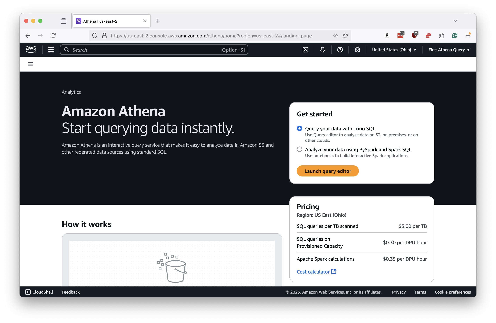

# What is Athena?

Athena is the name for a cloud-computing tool offered by Amazon Web Services that allows you to query static files, including the comma-delimited data that serves as the raw material for so much data analysis.

Athena can analyze massive datasets in seconds without a traditional server or database. While it does cost money, the prices are low, and there are no fixed, ongoing costs. You only pay for the data you upload and the queries you run.

## How do newsrooms use it?

Given the limitations of today’s personal computers, it becomes difficult to work with datasets larger than a few gigabytes. Campaign contributions, voter registration files, consumer complaints, climate estimates, social media extracts and many other newsworthy sources often exceed tens of millions of records and surpass the capabilities of a typical laptop.

Data journalists can turn to Athena to interrogate these datasets without having to invest in expensive hardware or learn a new programming language. SQL is a standard tool in the data journalist’s toolbox, and Athena is built to work with it.

In this tutorial, we will show you how Athena can easily handle the gigantic dataset created by the [U.S. Consumer Financial Protection Bureau](https://ffiec.cfpb.gov/) under the terms of the [Home Mortgage Disclosure Act](https://en.wikipedia.org/wiki/Home_Mortgage_Disclosure_Act). Data journalists commonly use the HMDA database to analyze lending patterns.