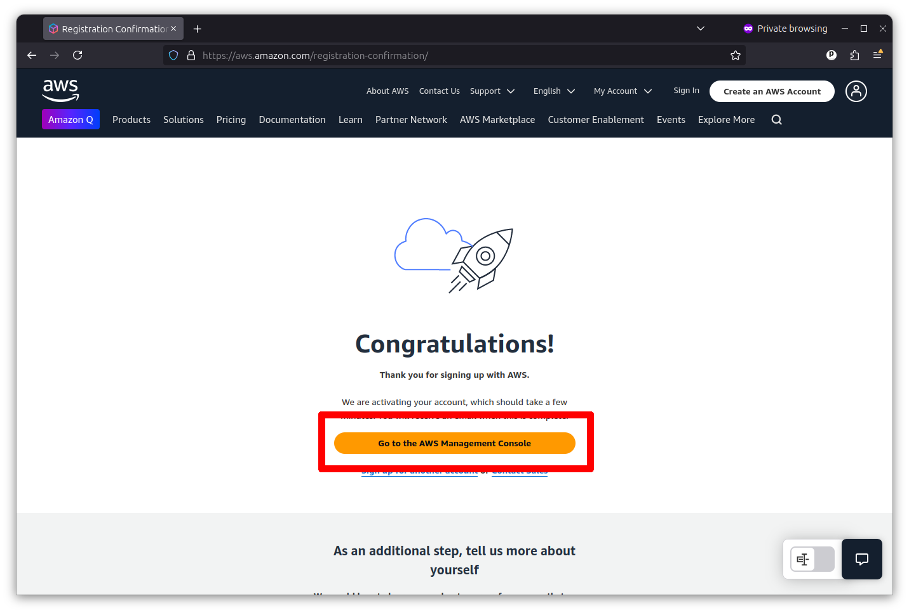
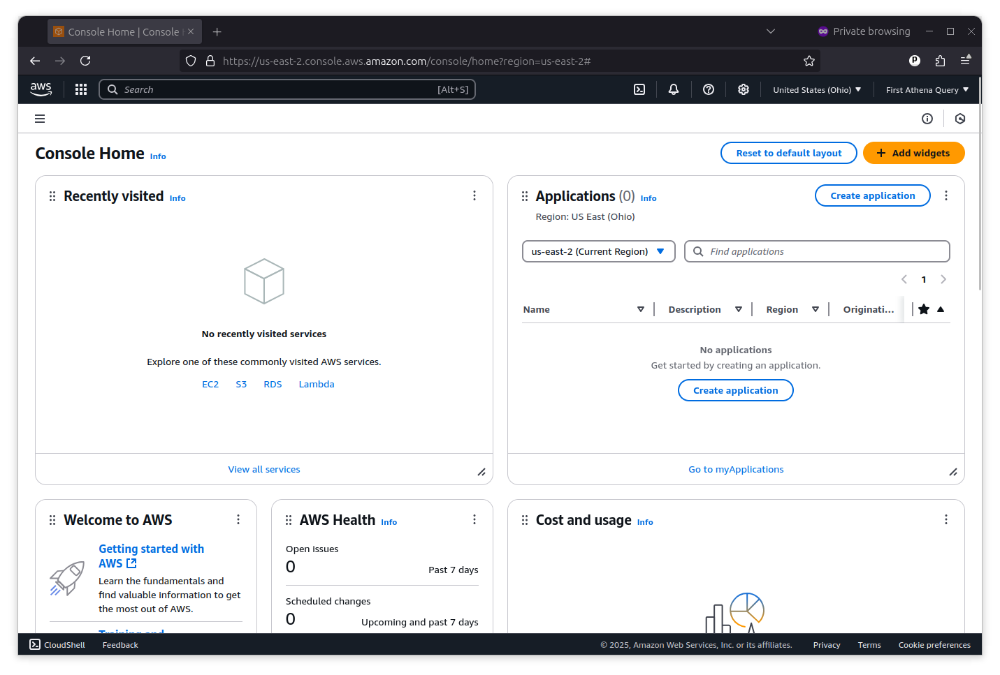

# Setting up an AWS account

If you don’t already have an Amazon Web Services account, the first step is to create one.  Go to [aws.amazon.com](https://aws.amazon.com/) and click the “Create an AWS account” button in the upper right corner.

You’ll provide a root email address and a name for the account. And then, you’ll be asked to verify your email. Then, you’ll enter a password, contact information and a payment method. You’ll also have to verify your phone number. Once you finish all that, you’ll be congratulated for your wherewithal.

Now, you can sign into Amazon’s management console and access its services.

