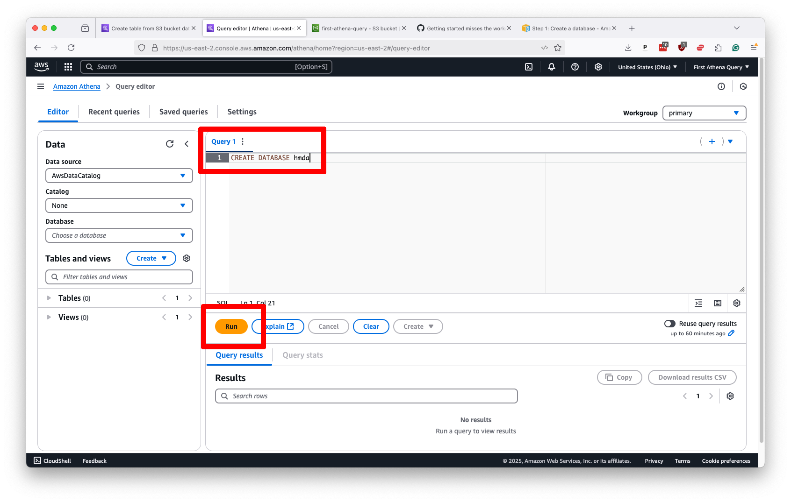

# Creating an Athena database

Once your data uploads to S3, you can link it to Athena by creating a virtual database.

Start by searching for “Athena” in the bar at the top of Amazon’s management console. Click on the first result.


That will take you to the Athena control panel, where you will see a box at the top of the page prompting you to configure the location of query results.

Hit the "Edit settings" button it presents.


That will take you to a form where we want to direct Athena to store its work in the `query-output` folder created in the previous chapter. Start by clicking the “Browse S3” button in the “Location of query result” field.


Then, navigate to the `query-output` folder in your bucket and select it.


Submit that without additional configuration. Your Athena panel should now be ready to work. Click on the “Editor” tab near the top left of the page to return to Athena’s control panel and start writing SQL.


The first step is creating a database in Athena’s system to store your data tables. You can name it whatever you like, but you should keep it clear and short.

Then, you draft [Athena's variation](https://docs.aws.amazon.com/athena/latest/ug/create-database.html) on the classic `CREATE DATABASE` statement. In our example, we will name our database after our source dataset, `hmda`.

```sql
CREATE DATABASE hmda
```

Drop that in the editor panel and submit the query by hitting the “Run” button.



You should see a success message in the results panel below the editor. This area is where you can expect to see the results of all your queries, including diagnostics, error messages and the data you request.


Now, select the database you’ve created from the left-hand panel to create a table containing your data.


Like any other SQL database, Athena requires that you define the structure of your data before you can query it. These strict SQL rules can be onerous, but they are necessary to ensure that your data is processed correctly.

Athena's variation on the standard [CREATE TABLE](https://docs.aws.amazon.com/athena/latest/ug/create-table.html) command requires that you spell out each of your columns and their respective data types, a typical requirement for SQL databases.

It also has extra requirements unique to its system that require you to specify the format of your static data and its location in S3, settings that will vary depending on the nature of your data.

In this example, we will create a table called `loans` describing the uploaded data. In addition to the column names and data types, which we determined by opening a sample file in a spreadsheet for manual review, the statement instructs Athena to look for CSV data in the `example-data` folder in our bucket and to skip the first line of the file, which contains headers.

```sql
CREATE EXTERNAL TABLE loans (
  activity_year int,
  lei string,
  state_code string,
  county_code string,
  census_tract string,
  derived_loan_product_type string,
  derived_dwelling_category string,
  derived_ethnicity string,
  derived_race string,
  derived_sex string,
  action_taken int,
  purchaser_type int,
  preapproval int,
  loan_type int,
  loan_purpose int,
  lien_status int,
  reverse_mortgage int,
  open_end_line_of_credit int,
  business_or_commercial_purpose int,
  debt_to_income_ratio string,
  applicant_credit_score_type string
)
ROW FORMAT DELIMITED
FIELDS TERMINATED BY ','
STORED AS TEXTFILE
LOCATION 's3://first-athena-query/example-data/'
TBLPROPERTIES ('skip.header.line.count'='1')
```

:::{admonition} Note
You can learn how to customize this query to other datasets by visiting the [data type documentation](https://docs.aws.amazon.com/athena/latest/ug/data-types.html) and examining Athena's [CREATE TABLE](https://docs.aws.amazon.com/athena/latest/ug/create-table.html) options.
:::

Creating our table is as simple as entering a command like that into the Athena editor and hitting "Run."


After the query is complete, you should see a success message in the results panel. Your table should now be visible in the left-hand panel of the Athena control panel.

