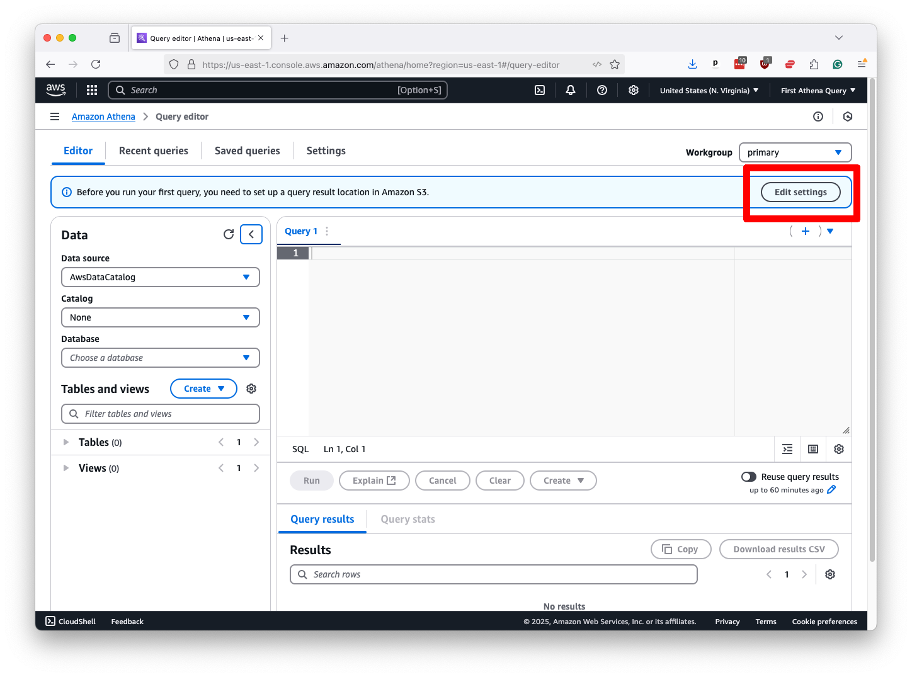
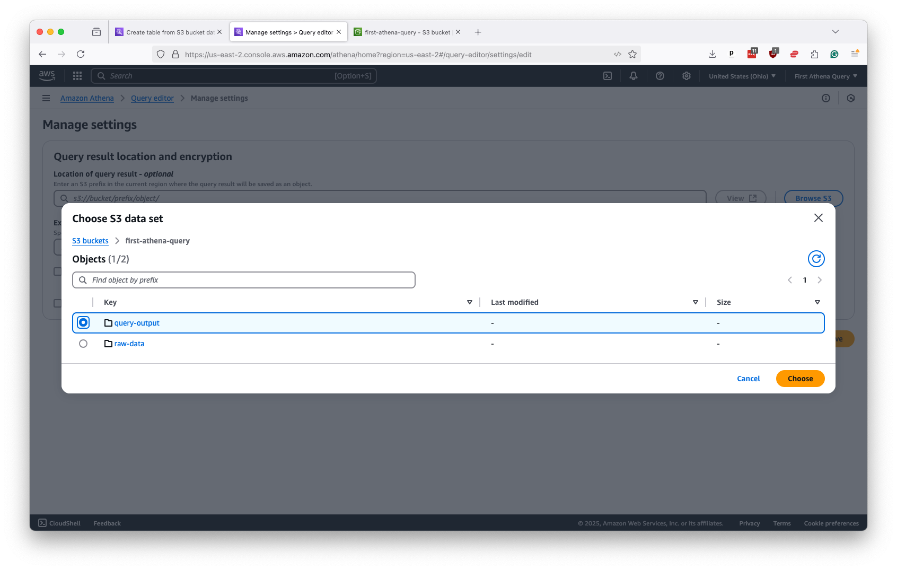
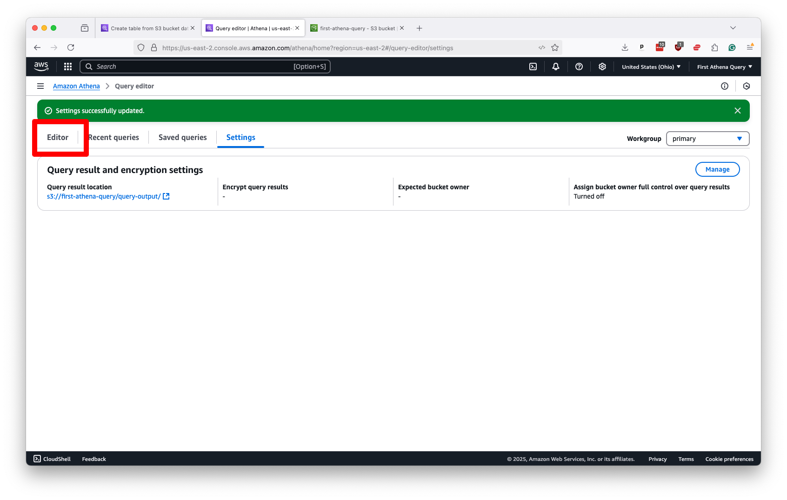

# First Athena Query

Analyze millions of records in seconds with Amazon Web Services and SQL

## What you will learn

We’ve all been there. Excel locks up. Your dataframe can’t hang. And that damn SQL query has been running for two days now.

There’s no way around it. The database you're working on is just too big for your laptop to handle.

This tutorial offers a solution: Amazon Athena. Follow along to learn how the web service can rip through records with the power of SQL.

## Who can take it

This course is free. Previous experience working with Amazon Web Services and SQL will come in handy, but anyone with good attitude is qualified to take the class. You will be charged for the AWS resources you use, so a credit card is required.

## Table of contents

* [What is Athena?](#what-is-athena)
* [How do newsrooms use it?](#how-do-newsrooms-use-it)
* [Setting up an AWS account](#setting-up-an-aws-account)
* [Uploading data](#uploading-data)
* [Configuring Athena](#configuring-athena)
* [Running your first query](#running-your-first-query)
* [Automating queries with Python](#automating-queries-with-python)

## What is Athena?

Athena is the name for a cloud-computing tool offered by Amazon Web Services that allows you to query static data files using SQL. It can analyze extremely large datasets in seconds without a traditional server or database. While it does cost money, the prices are low, and there are no fixed, on-going costs. You only pay for the data you upload and the queries you run.

## How do newsrooms use it?

TK TK TK

## Setting up an AWS account

The first step is to create an Amazon Web Services account, if you don't already have one. Go to [aws.amazon.com](https://aws.amazon.com/) and click the button that says "Create an AWS account" in the upper right corner.


You'll provide a root email address and a name for the account. And then you'll be asked to verify your email. Then you'll enter a password, contact information and a payment method. You'll also have to verify your phone number. Once that's completed, you'll be congratulated for your wherewithal.


Now you're ready to sign into the AWS Management Console, where you can access all of the services it offers.


## Uploading data

You need to create a place to store your data. Amazon S3 is a cloud storage service that allows you to hold static files in a folder known as a bucket. Our next step is to create a bucket for the dataset we'll analyze in this tutorial.

You should go to the search bar at the top of the console and search "S3". Then click on the link it offers.


That will take you to a landing page for the service that will offer a large button that says "Create bucket." Click it.


You can create a general purpose bucket with all of the default settings. Just make sure to give it a unique name. Then click "Create bucket" at the bottom of the form.


Now you have a bucket. Click on its name to open it up.


Now it's time to upload the data you'll be using. You can do that by clicking the "Upload" button at the top of the page and following the instructions there. 

Unlike a traditional database, you do not need to store your records in a single table or file. Athena will run queries across a nearly unlimited number of static data files, whatever their size, provided that they all share the same column headers and data types.

So you should aim to create a subdirectory where all of the files you want to analyze as posted side by side. You should make sure you they have the same schema. And then you should upload them all in a common data type. Athena recommends using the relatively new [parquet](https://en.wikipedia.org/wiki/Apache_Parquet) format, a favorite of data scientists in Silicon Valley, but you also use old-fashioned text files with [comma-separated values](https://en.wikipedia.org/wiki/Comma-separated_values).

For this demo, we wrangled our dataset using [a simple Python script](https://github.com/palewire/first-athena-query/tree/main/scripts/wrangle_hmda_data.py) that downloads from our source and uploads CSV files an S3 bucket.

The script downloads millions of mortgage loan applications gathered by the [U.S. Consumer Financial Protection Bureau](https://ffiec.cfpb.gov/) under the terms of the [Home Mortgage Disclosure Act](https://en.wikipedia.org/wiki/Home_Mortgage_Disclosure_Act). Data journalists commonly use the HMDA database to analyze lending patterns.

[](https://ffiec.cfpb.gov/)

:::{admonition} Note
If you decide to run our script yourself, be aware that these files are quite big, so the script can take several hours to run. You'll also need to adapt the Amazon credentials to conform your account.

There are different methods for keeping your laptop awake long enough to run scripts like this. [Caffeinate](https://ss64.com/mac/caffeinate.html), for example, is a terminal-based command that keeps your computer from sleeping while it's running. For this particular data-wrangling mission, we used a good old-fashioned video player to keep the computer up; specifically, we used [Nick Offerman's 'Yule Log' Ten Hour Version](https://www.youtube.com/watch?v=_StgHl92v5Q).
:::

Once your source data is uploaded, the file step on S3 is to create and output folder where Athena can store the result of its queries. You should do this hitting the "Create folder" button in the S3 toolbar and naming the new directory something like "query-output".


## Configuring Athena

Once your data and S3 are ready, search for "Athena" in the bar at the top of the Amazon's console. Click on the first option it returns.

That will take you to the Athena control panel, where you will be see a box at the top of the page prompting you to configure the location of query results. Hit the "Edit settings" button it presents.



That will take your to a form. Click on "Browse S3."


Then navigate to the query output folder you created and select it.



Submit that without any additional configuration and your Athena panel should show that it's ready to work. You should then click on the "Editor" tab near the top left of the page to return to Athena's query panel.



Now we finally start in with SQL. The first step is to create a database in Athena's system that will store your data tables. You can name it whatever you like, but you should try to keep it clear and short. Then you draft the classic `CREATE DATABASE` statement and submit it by hitting the "Run" button.

In our example, this will be:

```sql
CREATE DATABASE hmda
```


```sql
CREATE EXTERNAL TABLE hmda (
  activity_year int,
  lei string,
  state_code string,
  county_code string,
  census_tract string,
  derived_loan_product_type string,
  derived_dwelling_category string,
  derived_ethnicity string,
  derived_race string,
  derived_sex string,
  action_taken int,
  purchaser_type int,
  preapproval int,
  loan_type int,
  loan_purpose int,
  lien_status int,
  reverse_mortgage int,
  open_end_line_of_credit int,
  business_or_commercial_purpose int,
  debt_to_income_ratio string,
  applicant_credit_score_type string
)
ROW FORMAT DELIMITED
FIELDS TERMINATED BY ','
STORED AS TEXTFILE
LOCATION 's3://first-athena-query/example-data/'
```

## Running your first query

```sql
SELECT COUNT(*) FROM hmda.hmda
```


## Automating queries with Python

Running queries in Athena is great, but automating them in Python is even better. It could allow you run queries on a schedule, or to loop through a list of queries and run them without having to click buttons in the console.

Accessing Amazon Web Services with Python requires that you first establish an API key with permission to access the services you want to use. You can do that by clicking on the pulldown menu in the far upper right corner of the console and selecting "Security Credentials."


Then scroll down to the "Access keys" section and click the button that says "Create access key."


Now you can create a root key pair by checking the box and clicking the button that says "Create access key."


The final screen will show you the key's ID and secret. I've redacted my pair in the example below.


Copy and paste them into a text file for safekeeping. You will not be able to see the secret key again. They are what Python will use to gain access to AWS from outside the console.

Now you will need to install `boto3`, the most popular Python tool for working with AWS. You can do that from your terminal with the pipenv Python package manager.

```bash
pipenv install boto3
```

In your project directory, create a file named `.env` to store you AWS credentials and other sensitive information. It should look like the following. Unless you changed the default settings when creating your S3 bucket, the region name should be `us-east-1`.

```bash
AWS_ACCESS_KEY_ID=YOUR_ACCESS_KEY_ID
AWS_SECRET_ACCESS_KEY=YOUR_SECRET_ACCESS_KEY
AWS_REGION_NAME=YOUR_REGION_NAME
AWS_S3_BUCKET_NAME=YOUR_BUCKET_NAME
```

Create a new file called `athena.py` in your text editor of choice, we prefer [VSCode](https://code.visualstudio.com/), and paste in the following code.

It is a utility function that will allow you to run queries in Athena from Python. Read it carefully and you'll see how it uses `boto3` to send a SQL query to Athena and store the results in a subdirectory of your bucket named `athena-workspace`.

```python
"""Utilities for working Amazon Athena."""

from __future__ import annotations

import os
import time

import boto3


def query(
    sql: str,
    wait: int = 10,
    verbose: bool = False,
) -> str:
    """Execute SQL query on Amazon Athena.

    Args:
        sql : str
            formatted string containing athena sql query
        wait : int
            number of seconds to wait between checking query status
        verbose : bool
            whether to print verbose output

    Returns:
        str : query execution id

    Example:
        >>> query("SELECT COUNT(*) FROM my_database.my_table", verbose=True)
    """
    # Create the Athena client
    client = boto3.client("athena", region_name=os.getenv("AWS_REGION_NAME"))

    # Set the destination as our temporary S3 workspace folder
    s3_destination = f"s3://{os.getenv('AWS_S3_BUCKET_NAME')}/athena-workspace/"

    # Execute the query
    if verbose:
        print(f"Running query: {sql}")
    request = client.start_query_execution(
        QueryString=sql,
        ResultConfiguration={
            "OutputLocation": s3_destination,
        },
    )

    # Get the query execution id
    query_id = request["QueryExecutionId"]
    if verbose:
        print(f"Query ID: {query_id}")

    # Wait for the query to finish
    retry_count = 0
    while True:
        # Get the query execution state
        response = client.get_query_execution(QueryExecutionId=query_id)
        state = response["QueryExecution"]["Status"]["State"]

        # If it's still running, wait a little longer
        if state in ["RUNNING", "QUEUED"]:
            if verbose:
                print(f"Query state: {state}. Waiting {wait} seconds...")
            time.sleep(wait)
            retry_count += 1
        # If it failed, raise an exception
        else:
            break

    # Make sure it finished successfully
    if verbose:
        print(f"Query finished with state: {state}")
    assert state == "SUCCEEDED", f"query state is {state}"

    # Return the query id
    return query_id
```

You can now access the function in other Python files by importing the file we've created. As a simple example, create a second file named `run.py` and toss in the following:

```python
import athena

sql = "SELECT * FROM database"
q_id = athena.query(sql, verbose=True)
print(q_id)
```

Run the file in your terminal.

```bash
pipenv run python run.py
```

Your terminal should print out its progress as it issues the query and waits for a response from Athena. After it finishes, it will print out the identifier for the result. Return to your S3 bucket in your web browser and you should see it after clicking into the `athena-workspace` subdirectory.

SCREENSHOT TK

If you download the file and open it in a spreadsheet you'll see the results.

SCREENSHOT TK

That's a good start, but it's hassle that we have to go look up the result ourselves with all that pointing and clicking. We'll get that done by adding another utility function that can download the query result and return a data table you can work with in Python.

First you'll want to install pandas, a popular Python library for working with data. You can do that with whatever Python package manager you prefer.

```bash
pipenv install pandas
```

Reopen `athena.py` and edit the top of the file, above the query function, as follows. Notice how the `io` import has been added at the top and the `pandas` import has been added after `boto3`.

```python
"""Utilities for working with Amazon Athena."""

from __future__ import annotations

import io
import os
import time

import boto3
import pandas as pd


def get_dataframe(
    sql: str,
    verbose: bool = False,
    **kwargs,
) -> pd.DataFrame:
    """Get pandas DataFrame from Amazon Athena query.

    Args:
        sql : str
            formatted string containing athena sql query
        verbose : bool
            whether to print verbose output
        **kwargs
            additional keyword arguments to pass to the dataframe

    Returns:
        pd.DataFrame : pandas DataFrame containing query results

    Example:
        >>> sql = "SELECT COUNT(*) FROM my_database.my_table"
        >>> df = get_dataframe(sql, verbose=True)
        >>> print(df.head())
    """
    # Run the query
    job_id = query(sql, verbose=verbose)

    # Connect to Amazon S3
    client = boto3.client(
        "s3",
        aws_access_key_id=os.getenv("AWS_ACCESS_KEY_ID"),
        aws_secret_access_key=os.getenv("AWS_SECRET_ACCESS_KEY"),
    )

    # Download the file created by our query
    response = client.get_object(
        Bucket=os.getenv("AWS_S3_BUCKET_NAME"),
        Key=f"athena-workspace/{job_id}.csv",
    )

    # Convert it to the file object
    file_obj = io.BytesIO(response["Body"].read())

    # Read the file into a pandas DataFrame
    if kwargs is None:
        kwargs = {}
    df = pd.read_csv(file_obj, **kwargs)

    # Return the DataFrame
    return df
```

Once that's saved, return to `run.py` and change the file to take advantage of the new function.

```python
import athena

sql = "SELECT * FROM database"
df = athena.get_dataframe(sql, verbose=True)
print(df.head())
```

Now run the same command as before and you should see the DataFrame printed to your console.

```bash
pipenv run python run.py
```

This simple function is now all you need to run the full spectrum of SQL queries against your Athena database. You could repurpose it in one-off shell scripts, scheduled tasks, Jupyter notebooks or wherever else you code to analyze your data with ease.

It does, however, assume that you've already created an Athena table manually in the web console. To automate that process as well, you can add the following functions to `athena.py`, which will allow you to create and drop databases and tables. Notice that the `typing` import has been added at the top of the file.

```python
"""Utilities for working Amazon Athena."""

from __future__ import annotations

import io
import os
import time
import typing

import boto3
import pandas as pd


def create_database(
    database_name: str,
    verbose: bool = False,
) -> str:
    """Create Amazon Athena database.

    Args:
        database_name : str
            name of the database
        verbose : bool
            whether to print verbose output

    Returns:
        str : query execution id

    Example:
        >>> create_database("my_database", verbose=True)
    """
    if verbose:
        print(f"Creating {database_name} if it doesn't exist")
    return query(f"CREATE DATABASE IF NOT EXISTS {database_name}", verbose=verbose)


def drop_database(
    database_name: str,
    verbose: bool = False,
) -> str:
    """Drop Amazon Athena database.

    Args:
        database_name : str
            name of the database
        verbose : bool
            whether to print verbose output

    Returns:
        str : query execution id

    Example:
        >>> drop_database("my_database", verbose=True)
    """
    if verbose:
        print(f"Dropping {database_name} if it exists")
    return query(f"DROP DATABASE IF EXISTS {database_name}", verbose=verbose)


def create_table(
    database_name: str,
    table_name: str,
    field_list: list[list[str, str]],
    location: str,
    stored_as: typing.Literal["PARQUET", "CSV"] = "CSV",
    verbose: bool = False,
) -> str:
    """Create Amazon Athena table.

    Args:
        database_name : str
            name of the database
        table_name : str
            name of the table
        field_list : list[list[str, str]]
            list of field names and types. e.g. [["id", "INT"], ["name", "STRING"]].
            Reference for field types available at https://docs.aws.amazon.com/athena/latest/ug/data-types.html
        location : str
            s3 location of the data inside AWS S3 bucket. e.g. 's3://my-bucket/my-folder/' would be /my-folder/
        stored_as : str
            file format of the source data. e.g. "PARQUET" or "CSV"
        verbose : bool
            whether to print verbose output

    Returns:
        str : query execution id

    Example:
        >>> create_table(
        ...     "my_database",
        ...     "my_table",
        ...     [["id", "INT"], ["name", "STRING"]],
        ...     "/my-folder/",
        ...     verbose=True,
        ... )
    """
    # Create the SQL statement
    sql = f"CREATE EXTERNAL TABLE IF NOT EXISTS {database_name}.{table_name} (\n"
    for field in field_list:
        sql += f"    {field[0]} {field[1]},\n"
    sql = sql[:-2] + "\n)\n"
    sql += f"STORED AS {stored_as}\n"
    sql += f"LOCATION '{location}'"

    # Run the query
    if verbose:
        print(f"Creating Athena table: {database_name}.{table_name}")
    return query(sql, verbose=verbose)


def drop_table(
    database_name: str,
    table_name: str,
    verbose: bool = False,
) -> str:
    """Drop Amazon Athena table.

    Args:
        database_name : str
            name of the database
        table_name : str
            name of the table
        verbose : bool
            whether to print verbose output

    Returns:
        str : query execution id

    Example:
        >>> drop_table("my_database", "my_table", verbose=True)
    """
    # Drop the table if it exists
    if verbose:
        print(f"Dropping {database_name}.{table_name} if it exists")
    return query(f"DROP TABLE IF EXISTS {database_name}.{table_name}", verbose=verbose)
```

Now if you return to the `run.py` file and add code that will recreate the steps we executed manually earlier in the class.

```python
import athena

# Create the database
athena.create_database("my_database", verbose=True)

# Create the table
athena.create_table(
    database_name="my_database",
    table_name="my_table",
    field_list=[
        ["id", "INT"],
        ["name", "STRING"],
    ],
    location="/my-folder/",
    verbose=True,
)

# Run the query
sql = "SELECT COUNT(*) FROM my_database.my_table"
df = athena.get_dataframe(sql, verbose=True)

print(df.head())
```

Run the file in your terminal.

```bash
pipenv run python run.py
```

You should see the same results as before, but now you've fully automated Athena, a process that could be repeated with limitless tables and data. Our work here is done. Go forth with furious gusto.

## About this class

This guide was prepared by [Ben Welsh](https://palewi.re/who-is-ben-welsh/) and [Katlyn Alo](https://www.linkedin.com/in/katalo/) for [a training session](https://schedules.ire.org/nicar-2025/index.html#2080) at the National Institute for Computer-Assisted Reporting’s 2025 conference in Minnapolis. Some of the copy was written with the assistance of GitHub’s Copilot, an AI-powered text generator. The materials are available as free and [open source on GitHub](https://github.com/palewire/first-athena-query).
