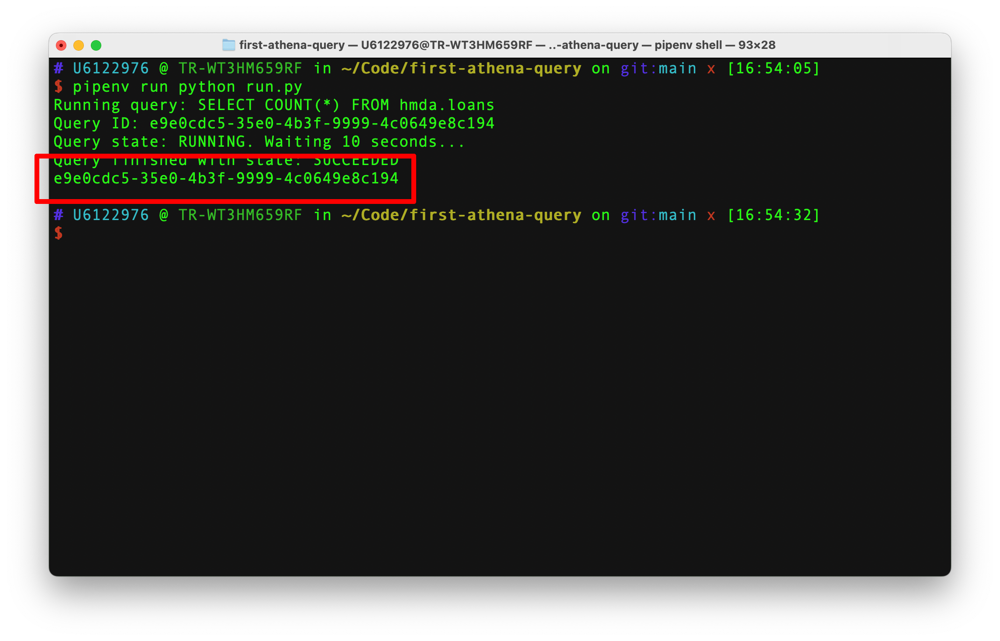
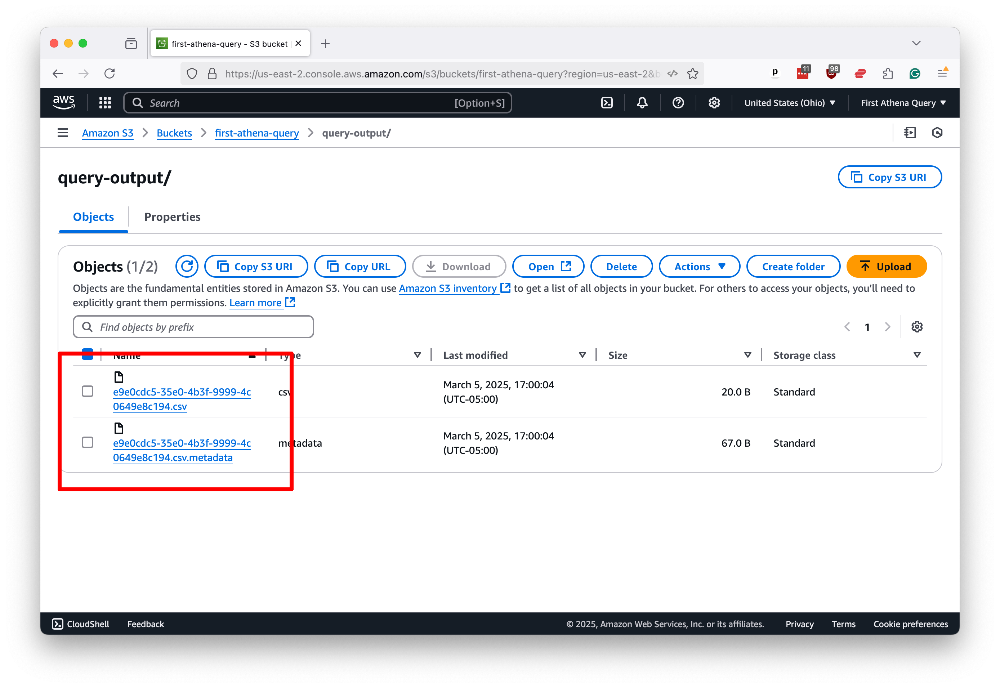
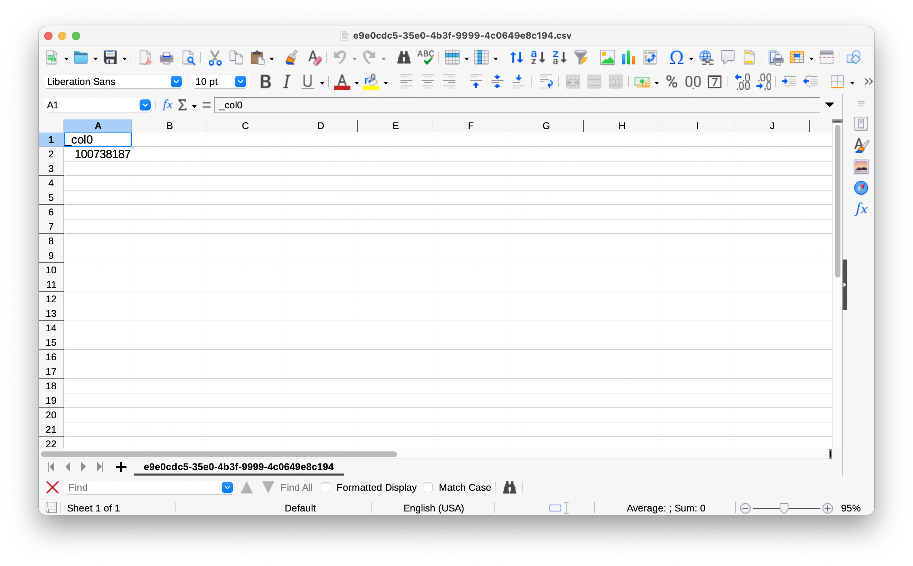
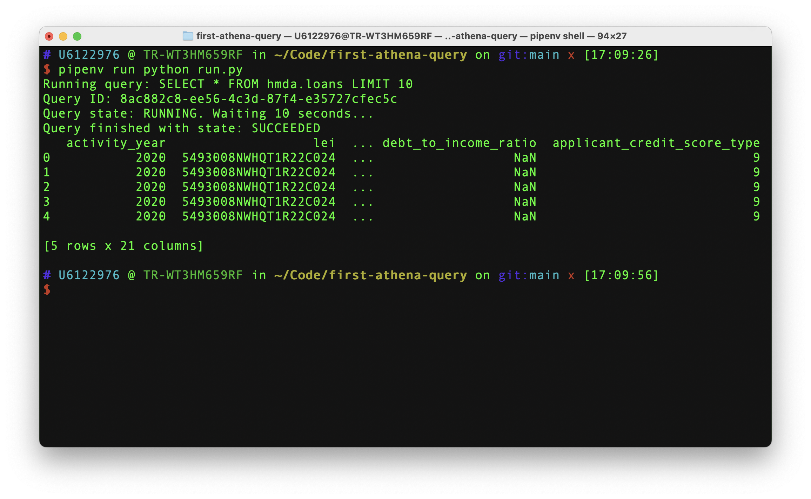

# Automating Athena with Python

Running queries in Athena is great, but automating them in Python is even better. With Python, you can run a query on a regular schedule, execute a list of queries in series and pull any number of other tricks without having to sit around and click buttons in Amazon’s web console.

Accessing Amazon Web Services with Python requires first establishing secret keys with permission to access the platform on your behalf. You can do that by clicking on the pulldown menu in the far upper right corner of the console and selecting “Security credentials.”


Then scroll down to the “Access keys” section and click the “Create access key” button.


Now, you can create a root key pair by checking the box and clicking the “Create access key” button.


The final screen will show you the key’s identifier and secret. I’ve redacted my pair in the example below. 


Please copy and paste them into a text file for safekeeping. Python will use them to gain access to Amazon Web Services from outside the console.

Now you will need to install [`boto3`](https://pypi.org/project/boto3/), the most popular Python tool for working with Amazon Web Services. You can do that from your terminal with the [`pipenv`](https://pipenv.pypa.io/en/latest/) Python package manager, or whatever package manager you prefer.

You must install [`boto3`](https://pypi.org/project/boto3/), the most popular Python tool for working with Amazon Web Services. You can do that from your terminal with the [`pipenv`](https://pipenv.pypa.io/en/latest/) package manager or whatever installation tool you prefer.

```bash
pipenv install boto3
```

Create a file named `.env` in your project directory to store your AWS credentials and other sensitive information. It should look like the following:

```
AWS_ACCESS_KEY_ID=YOUR_ACCESS_KEY_ID
AWS_SECRET_ACCESS_KEY=YOUR_SECRET_ACCESS_KEY
AWS_REGION_NAME=YOUR_REGION_NAME
AWS_S3_BUCKET_NAME=YOUR_BUCKET_NAME
```

The key identifier and secret are the two values you copied from the AWS console. The bucket is the name of the S3 bucket you created in the previous chapter. Unless you changed the default settings when creating your S3 bucket, the region name should be `us-east-1`.

:::{admonition} Note
If you’re using a tool other than `pipenv`, you’ll need to manage the secrets in whatever manner your system prefers.
:::

Please create a new file called `athena.py` in your text editor of choice — we prefer Microsoft's VSCode — and paste the following:

```python
"""Utilities for working with Amazon Athena."""

from __future__ import annotations

import os
import time

import boto3


def query(
    sql: str,
    wait: int = 10,
    verbose: bool = False,
) -> str:
    """Execute SQL query on Amazon Athena.

    Args:
        sql : str
            formatted string containing athena sql query
        wait : int
            number of seconds to wait between efforts to check the query status
        verbose : bool
            whether to print verbose output

    Returns:
        str : query execution id

    Example:
        >>> query("SELECT COUNT(*) FROM my_database.my_table", verbose=True)
    """
    # Create the Athena client
    client = boto3.client("athena", region_name=os.getenv("AWS_REGION_NAME"))

    # Set the destination as our temporary S3 workspace folder
    s3_destination = f"s3://{os.getenv('AWS_S3_BUCKET_NAME')}/query-output/"

    # Execute the query
    if verbose:
        print(f"Running query: {sql}")
    request = client.start_query_execution(
        QueryString=sql,
        ResultConfiguration={
            "OutputLocation": s3_destination,
        },
    )

    # Get the query execution id
    query_id = request["QueryExecutionId"]
    if verbose:
        print(f"Query ID: {query_id}")

    # Wait for the query to finish
    retry_count = 0
    while True:
        # Get the query execution state
        response = client.get_query_execution(QueryExecutionId=query_id)
        state = response["QueryExecution"]["Status"]["State"]

        # If it's still running, wait a little longer
        if state in ["RUNNING", "QUEUED"]:
            if verbose:
                print(f"Query state: {state}. Waiting {wait} seconds...")
            time.sleep(wait)
            retry_count += 1
        # If it failed, raise an exception
        else:
            break

    # Make sure it finished successfully
    if verbose:
        print(f"Query finished with state: {state}")
    assert state == "SUCCEEDED", f"query state is {state}"

    # Return the query id
    return query_id
```

It is a utility function that allows you to run queries in Athena from Python. Read it carefully, and you’ll see how it uses `boto3` to send an SQL query to Athena and store the results in a subdirectory of your bucket named `query-output`.

You can access the function in other Python files by importing the file we've created. As a simple example, create a second file named `run.py` and toss in the following:

```python
import athena

sql = "SELECT COUNT(*) FROM hmda.loans"
q_id = athena.query(sql, verbose=True)
print(q_id)
```

Save the file and run it in your terminal.

```bash
pipenv run python run.py
```

Your terminal should print out its progress as it issues the query and waits for a response from Athena. After it finishes, the identifier for the result will print.



Return to your S3 bucket in your web browser. Click into the `query-output` directory. You should now see two files with the same name as the identifier in your terminal. One will end with `.csv`. The other will end with `.csv.metadata`.



The `.csv` file contains the query results, the same as those in Athena's results panel. The second file contains a bundle of information about your request.

If you download the results file and open it in a spreadsheet, you'll see the same thing we saw in Athena: a single row with a single column containing the number of rows in the `loans` table.



That's cool, but it's a hassle to look up the result ourselves with all that pointing and clicking. Let's have Python take care of that, too.

First, you'll want to install [`pandas`](https://pypi.org/project/pandas/), a popular Python library for working with data. You can do that with whatever Python package manager you prefer.

```bash
pipenv install pandas
```

Reopen `athena.py` and edit the top of the file above the query function. Notice how the `io` import is now at the top and the `pandas` import is after `boto3`.

```python
"""Utilities for working with Amazon Athena."""

from __future__ import annotations

import io
import os
import time

import boto3
import pandas as pd


def get_dataframe(
    sql: str,
    verbose: bool = False,
    **kwargs,
) -> pd.DataFrame:
    """Get pandas DataFrame from Amazon Athena query.

    Args:
        sql : str
            formatted string containing athena sql query
        verbose : bool
            whether to print verbose output
        **kwargs
            additional keyword arguments to pass to the dataframe

    Returns:
        pd.DataFrame : pandas DataFrame containing query results

    Example:
        >>> sql = "SELECT COUNT(*) FROM my_database.my_table"
        >>> df = get_dataframe(sql, verbose=True)
        >>> print(df.head())
    """
    # Run the query
    job_id = query(sql, verbose=verbose)

    # Connect to Amazon S3
    client = boto3.client(
        "s3",
        aws_access_key_id=os.getenv("AWS_ACCESS_KEY_ID"),
        aws_secret_access_key=os.getenv("AWS_SECRET_ACCESS_KEY"),
        region_name=os.getenv("AWS_REGION_NAME"),
    )

    # Download the file created by our query
    response = client.get_object(
        Bucket=os.getenv("AWS_S3_BUCKET_NAME"),
        Key=f"query-output/{job_id}.csv",
    )

    # Convert it to the file object
    file_obj = io.BytesIO(response["Body"].read())

    # Read the file into a pandas DataFrame
    if kwargs is None:
        kwargs = {}
    df = pd.read_csv(file_obj, **kwargs)

    # Return the DataFrame
    return df
```

Return to `run.py` and change the file to take advantage of the new function. While we're at it, let's tweak our query, too.

{emphasize-lines="3-5"}
```python
import athena

sql = "SELECT * FROM hmda.loans LIMIT 10"
df = athena.get_dataframe(sql, verbose=True)
print(df.head())
```

Now run the same command as before.

```bash
pipenv run python run.py
```

And you should see the pandas DataFrame printed to your console.



This simple function is now all you need to run the full spectrum of SQL queries against your Athena database and retrieve the results for further processing in Python. You could repurpose it in one-off shell scripts, scheduled tasks, Jupyter notebooks, or wherever else you'd like to code.

However, it assumes you’ve manually created an Athena table in the web console. Add the following functions to `athena.py` to automate that process.

```python
"""Utilities for working Amazon Athena."""

from __future__ import annotations

import io
import os
import time

import boto3
import pandas as pd


def create_database(
    database_name: str,
    verbose: bool = False,
) -> str:
    """Create Amazon Athena database.

    Args:
        database_name : str
            name of the database
        verbose : bool
            whether to print verbose output

    Returns:
        str : query execution id

    Example:
        >>> create_database("my_database", verbose=True)
    """
    if verbose:
        print(f"Creating {database_name} if it doesn't exist")
    return query(f"CREATE DATABASE IF NOT EXISTS {database_name}", verbose=verbose)


def drop_database(
    database_name: str,
    verbose: bool = False,
) -> str:
    """Drop Amazon Athena database.

    Args:
        database_name : str
            name of the database
        verbose : bool
            whether to print verbose output

    Returns:
        str : query execution id

    Example:
        >>> drop_database("my_database", verbose=True)
    """
    if verbose:
        print(f"Dropping {database_name} if it exists")
    return query(f"DROP DATABASE IF EXISTS {database_name}", verbose=verbose)


def create_table(
    database_name: str,
    table_name: str,
    field_list: list[list[str, str]],
    location: str,
    verbose: bool = False,
) -> str:
    """Create Amazon Athena table.

    Args:
        database_name : str
            name of the database
        table_name : str
            name of the table
        field_list : list[list[str, str]]
            list of field names and types. e.g. [["id", "INT"], ["name", "STRING"]].
            Reference for field types available at https://docs.aws.amazon.com/athena/latest/ug/data-types.html
        location : str
            s3 location of the data inside AWS S3 bucket. e.g. 's3://my-bucket/my-folder/' would be /my-folder/
        verbose : bool
            whether to print verbose output

    Returns:
        str : query execution id

    Example:
        >>> create_table(
        ...     "my_database",
        ...     "my_table",
        ...     [["id", "INT"], ["name", "STRING"]],
        ...     "/my-folder/",
        ...     verbose=True,
        ... )
    """
    # Create the SQL statement
    sql = f"CREATE EXTERNAL TABLE IF NOT EXISTS {database_name}.{table_name} (\n"
    for field in field_list:
        sql += f"    {field[0]} {field[1]},\n"
    sql = sql[:-2] + "\n)\n"
    sql += "ROW FORMAT DELIMITED\n"
    sql += "FIELDS TERMINATED BY ','\n"
    sql += "STORED AS TEXTFILE\n"
    sql += f"LOCATION 's3://{os.getenv('AWS_S3_BUCKET_NAME')}{location}'\n"
    sql += "TBLPROPERTIES ('skip.header.line.count'='1')"

    # Run the query
    if verbose:
        print(f"Creating Athena table: {database_name}.{table_name}")
    return query(sql, verbose=verbose)


def drop_table(
    database_name: str,
    table_name: str,
    verbose: bool = False,
) -> str:
    """Drop Amazon Athena table.

    Args:
        database_name : str
            name of the database
        table_name : str
            name of the table
        verbose : bool
            whether to print verbose output

    Returns:
        str : query execution id

    Example:
        >>> drop_table("my_database", "my_table", verbose=True)
    """
    # Drop the table if it exists
    if verbose:
        print(f"Dropping {database_name}.{table_name} if it exists")
    return query(f"DROP TABLE IF EXISTS {database_name}.{table_name}", verbose=verbose)
```

If we were to begin again from scratch, we could recreate all of the steps we took to setup our database with the following:

```python
import athena

# Create the database
athena.create_database("hmda", verbose=True)

# Create the table
athena.create_table(
    database_name="hmda",
    table_name="loans",
    field_list=[
        ["activity_year", "int"],
        ["lei", "string"],
        ["state_code", "string"],
        ["county_coder", "string"],
        ["census_tract", "string"],
        ["derived_loan_product_type", "string"],
        ["derived_dwelling_category", "string"],
        ["derived_ethnicity", "string"],
        ["derived_race", "string"],
        ["derived_sex", "string"],
        ["action_taken", "int"],
        ["purchaser_type", "int"],
        ["preapproval", "int"],
        ["loan_type", "int"],
        ["loan_purpose", "int"],
        ["lien_status", "int"],
        ["reverse_mortgage", "int"],
        ["open_end_line_of_credit", "int"],
        ["business_or_commercial_purpose", "int"],
        ["debt_to_income_ratio", "string"],
        ["applicant_credit_score_type", "string"]
    ],
    location="/example-data/",
    verbose=True,
)
```

Running a query from Python would be as simple as before.

```python
import athena

sql = "SELECT COUNT(*) FROM hmda.loans"
df = athena.get_dataframe(sql, verbose=True)
print(df.head())
```

You would see the same results now as in a fully automated process that could be remixed and repeated with limitless tables, data and queries. Our work here is done.