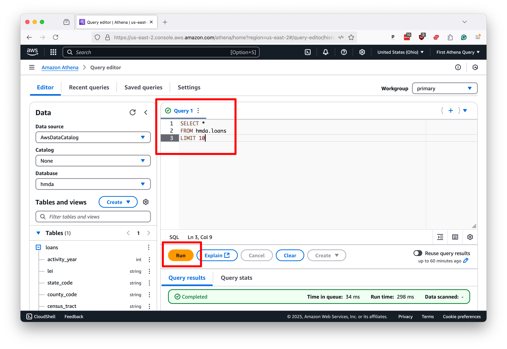
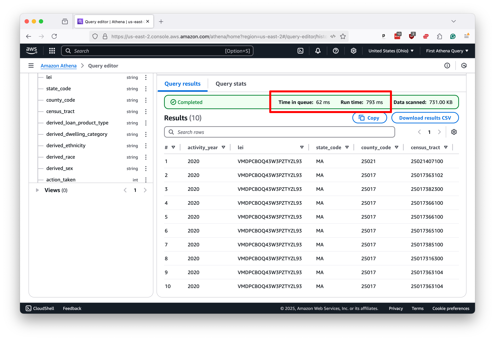
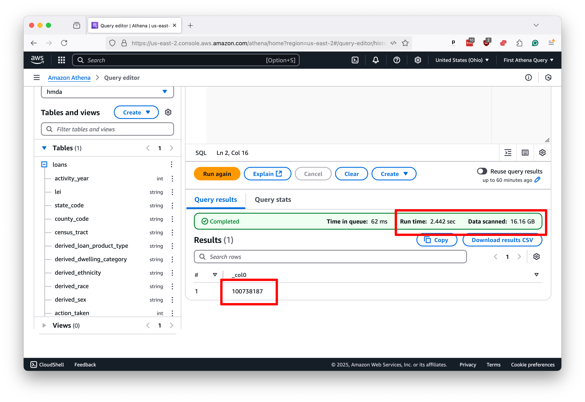
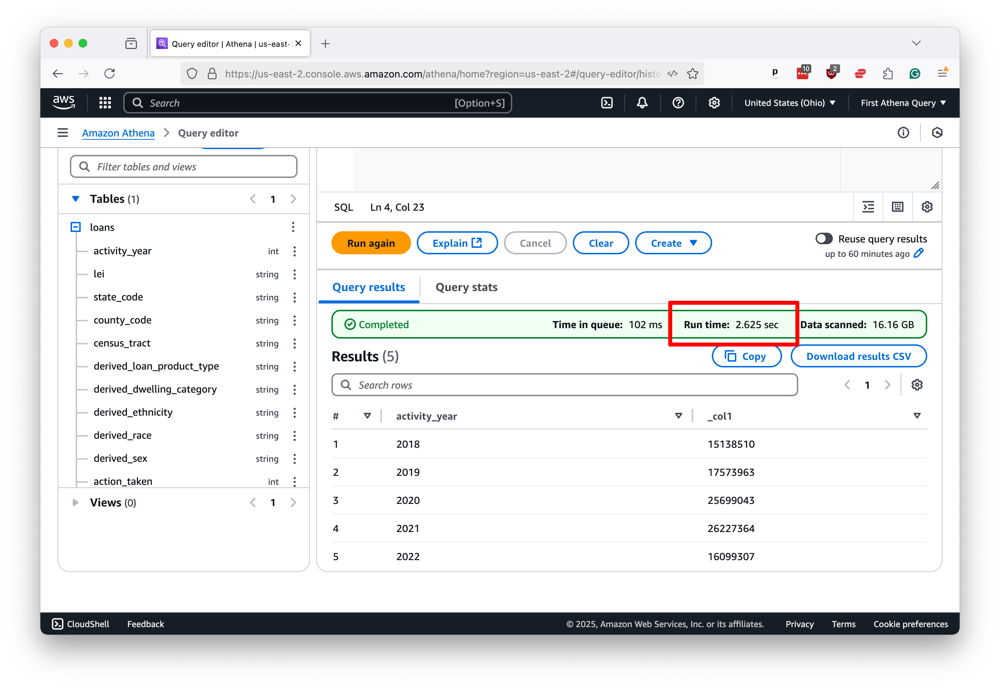
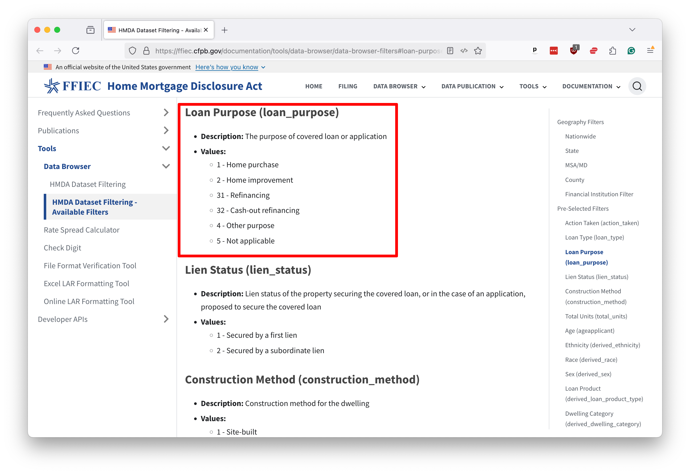
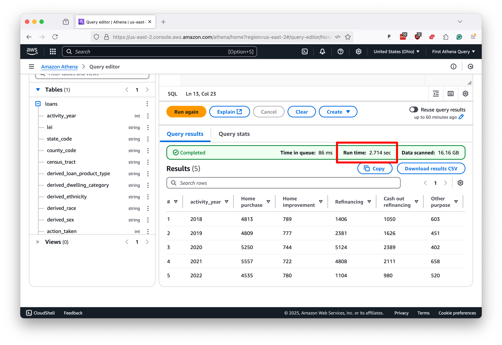

# Running SQL with Athena

After all that preparation, it's finally time to write some queries.

Let’s start with something simple. To get a taste of your data, select all columns from the `hmda.loans` table and limit the results to 10 rows, a common technique.

The SQL we’ll write is this simple command, roughly the same as you’d write in any database:

```sql
SELECT *
FROM hmda.loans
LIMIT 10
```

To issue the query to Athena, you drop the SQL into the editor panel and, as before, hit “Run.”



That will kickstart the process. Within a few seconds, you should see 10 rows of data appear below the editor, along with a message reporting how long it took to run the query. Note that the process took less than one second in this demonstration case.



Let's try again with something a little more ambitious. This classic query will count all of the rows in the table, which will require Athena to run across all the files we loaded into the S3 bucket.

```sql
SELECT COUNT(*)
FROM hmda.loans
```

If you’ve been frustrated by the slow pace of SQL queries in the past, what you see next might surprise you. Athena scanned 16 gigabytes of data and counted 100 million rows in roughly 2.5 seconds.



That "Data scanned" number is a good proxy for how much you'll be charged for the query. The more data you scan, the more you pay. At the time of this writing, the cost is $5 per terabyte.

You’ll see similar results with more complex queries. Here’s a simple step-up that groups the data by the `activity_year` column and counts the number of rows in each group, roughly the equivalent of a pivot table in Excel.

```
SELECT activity_year, COUNT(*)
FROM hmda.loans
GROUP BY activity_year
ORDER BY activity_year
```

Again, the results return with blazing speed.



While speeds will vary based on data size, query complexity, and the queue of other users in the system, Athena can quickly return almost any SQL query you throw at it.

We won’t conduct a complete, polished data analysis in this tutorial, but here’s an example of a more complex query that a data journalist might dream up for a real story.

Let us presume that we’d like to examine the trends in lending patterns in Johnson County, Iowa, where Ben grew up.

We could filter this nationwide dataset down to the county in question using the `county_code` field and then calculate the number of loans by year and purpose.

A [quick web search](https://www.icip.iastate.edu/maps/refmaps/COFIPS) will reveal that Johnson County's unique identifier is 19103. If we visit the [official documentation]((https://ffiec.cfpb.gov/documentation/tools/data-browser/data-browser-filters#loan-purpose-loan_purpose)) for the HMDA database, we can find a dictionary explaining the meaning of each field. It shows that the `loan_purpose` field can have one of six values, each representing a different reason for the loan.

[](https://ffiec.cfpb.gov/documentation/tools/data-browser/data-browser-filters#loan-purpose-loan_purpose)

Using that knowledge, we can compose a query that will cross-tabulate the number of loans by year and purpose in Johnson County. As rudimentary as it is, this operation can sometimes take hours to execute on personal computers.

```sql
SELECT 
    activity_year,
    SUM(CASE WHEN loan_purpose = 1 THEN 1 ELSE 0 END) as "Home purchase",
    SUM(CASE WHEN loan_purpose = 2 THEN 1 ELSE 0 END) as "Home improvement",
    SUM(CASE WHEN loan_purpose = 31 THEN 1 ELSE 0 END) as "Refinancing",
    SUM(CASE WHEN loan_purpose = 32 THEN 1 ELSE 0 END) as "Cash out refinancing",
    SUM(CASE WHEN loan_purpose = 4 THEN 1 ELSE 0 END) as "Other purpose",
    SUM(CASE WHEN loan_purpose = 5 THEN 1 ELSE 0 END) as "N/A",
    COUNT(*) as "Total"
FROM hmda.loans
WHERE county_code = '19103'
GROUP BY activity_year
ORDER BY activity_year
```

Run it in Athena, and you'll see the results almost immediately. In this case, it takes less than three seconds.



By now, you should have a good sense of how to use Athena to query large datasets quickly and efficiently. Armed with this knowledge, you can start to explore the data in your S3 bucket and uncover the stories hidden within.

In our next chapter, we'll show you how you can use the Python computer programming language script and schedule your queries to run outside of the web interface.