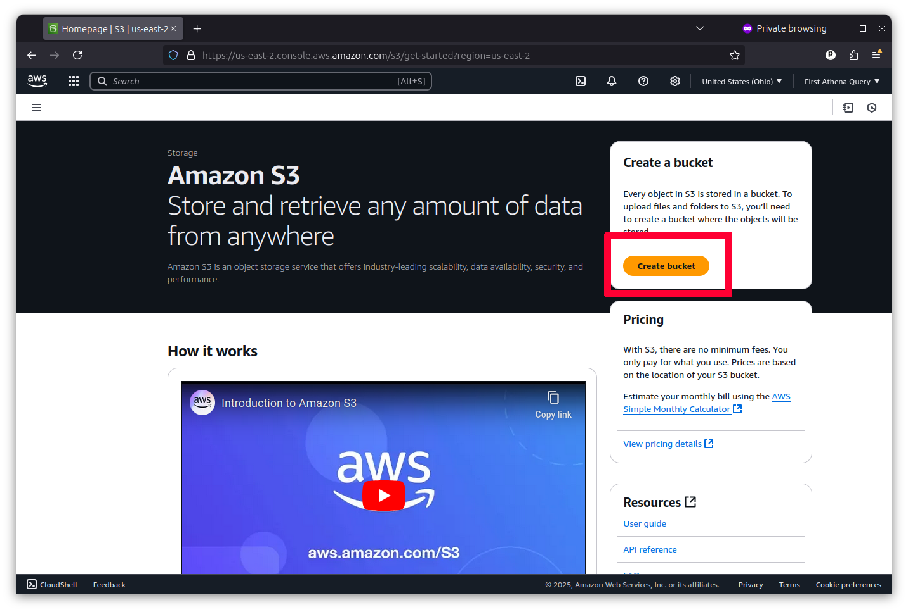

# Uploading data

You need to create a place to store your data. Amazon S3 is a cloud storage service that allows you to hold static files in a folder known as a bucket. Our next step is to create a bucket for the dataset we'll analyze in this tutorial.

You should go to the search bar at the top of the console and search "S3". Then click on the link it offers.

That will take you to a landing page for the service that will offer a large button that says "Create bucket." Click it.

You can create a general purpose bucket with all of the default settings. Just make sure to give it a unique name. Then click "Create bucket" at the bottom of the form.

Now you have a bucket. Click on its name to open it up.

Now it's time to upload the data you'll be using. You can do that by clicking the "Upload" button at the top of the page and following the instructions there. 

Unlike a traditional database, you do not need to store your records in a single table or file. Athena will run queries across a nearly unlimited number of static data files, whatever their size, provided that they all share the same column headers and data types.

So you should aim to create a subdirectory where all of the files you want to analyze as posted side by side. You should make sure you they have the same schema. And then you should upload them all in a common data type. Athena recommends using the relatively new [parquet](https://en.wikipedia.org/wiki/Apache_Parquet) format, a favorite of data scientists in Silicon Valley, but you also use old-fashioned text files with [comma-separated values](https://en.wikipedia.org/wiki/Comma-separated_values).

For this demo, we wrangled our dataset using [a simple Python script](https://github.com/palewire/first-athena-query/tree/main/scripts/wrangle_hmda_data.py) that downloads from our source and uploads CSV files an S3 bucket.

The script downloads millions of mortgage loan applications gathered by the [U.S. Consumer Financial Protection Bureau](https://ffiec.cfpb.gov/) under the terms of the [Home Mortgage Disclosure Act](https://en.wikipedia.org/wiki/Home_Mortgage_Disclosure_Act).

:::{admonition} Note
If you decide to run our script yourself, be aware that these files are quite big, so the script can take several hours to run. You'll also need to adapt the Amazon credentials to conform your account.

There are different methods for keeping your laptop awake long enough to run scripts like this. [Caffeinate](https://ss64.com/mac/caffeinate.html), for example, is a terminal-based command that keeps your computer from sleeping while it's running. For this particular data-wrangling mission, we used a good old-fashioned video player to keep the computer up; specifically, we used [Nick Offerman's 'Yule Log' Ten Hour Version](https://www.youtube.com/watch?v=_StgHl92v5Q).
:::

Once your source data is uploaded, the file step on S3 is to create and output folder where Athena can store the result of its queries. You should do this hitting the "Create folder" button in the S3 toolbar and naming the new directory something like "query-output".

