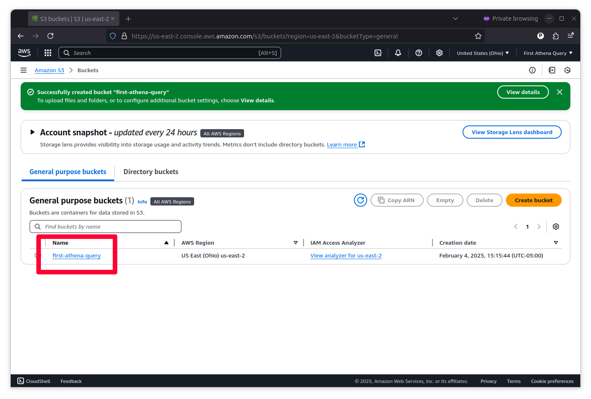
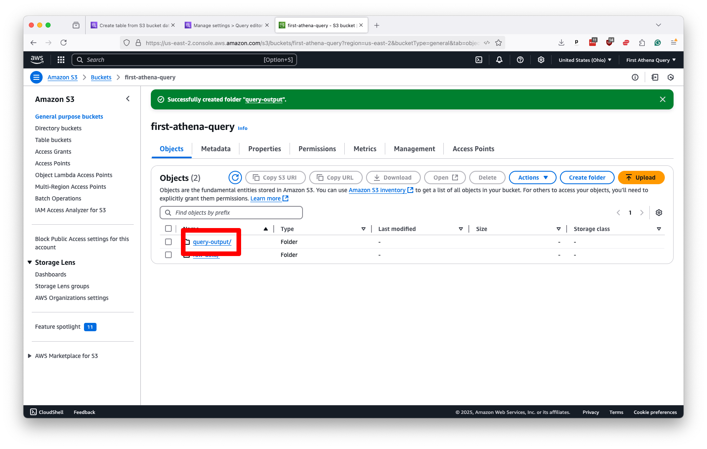

# Uploading data to S3

Before Athena can analyze your data, you need to upload it to Amazon's data centers using a product known as Simple Storage Service or, more commonly, [S3](https://en.wikipedia.org/wiki/Amazon_S3).

You should go to the search bar at the top of the console and search "S3". Then click on the link it offers.

Amazon S3 allows you to hold nearly unlimited static files in a virtual folder known as a bucket. To create one, click the large button that says “Create bucket.”

Accepting the default settings allows you to create a general-purpose bucket suitable for private data analysis. Just make sure to give your folder a unique name, like `first-athena-query`. Then click the “Create bucket” button at the bottom of the form.

Now, you should see your new bucket in a list. Click on its name to open it.

It’s time to upload your data. One way to do that is to click the “Upload” button at the top of the page and follow the instructions there.

Unlike a traditional database, Athena does not require storing your records in a single table or file. Athena can run queries across a folder of static data files, whatever their size, provided they all share the same column headers and data types.

So, you should create a subdirectory in the bucket where all of the files you want to analyze are posted side by side. You must be very careful to ensure they all share the same schema. You should consistently format them all in a data format supported by Athena, [a list](https://docs.aws.amazon.com/athena/latest/ug/notebooks-spark-data-and-storage-formats.html) that includes traditional [comma-separated values](https://en.wikipedia.org/wiki/Comma-separated_values) and the popular [Javascript Object Notation](https://en.wikipedia.org/wiki/JSON), as well as more efficient formats favored by data scientists like [Apache Parquet](https://en.wikipedia.org/wiki/Apache_Parquet).

We won’t upload our data using the point-and-click interface for this demonstration. Instead, we prepared our example data using [a Python script](https://github.com/palewire/first-athena-query/tree/main/scripts/wrangle_hmda_data.py) that downloads millions of mortgage loan applications gathered by the [U.S. Consumer Financial Protection Bureau](https://ffiec.cfpb.gov/) and uploads CSV files to our S3 bucket using the [boto3](https://boto3.amazonaws.com/v1/documentation/api/latest/index.html) library.

The script deposited our data in a subdirectory called `example-data` in our bucket, which is where we will ask Athena to direct its queries.

:::{admonition} Note
If you decide to run our script, be aware that these files are pretty big, so the process can take several hours. You’ll also need to adapt the Amazon credentials to suit your account, which will require creating an API key, a task we don't cover in this guide.

There are different methods for keeping your laptop awake long enough to run scripts like this. [Caffeinate](https://ss64.com/mac/caffeinate.html), for example, is a terminal-based command that keeps your computer from sleeping while running. For this data-wrangling mission, we used a good old-fashioned video player to keep the laptop awake; specifically, we used [“Nick Offerman's 'Yule Log' Ten Hour Version”](https://www.youtube.com/watch?v=_StgHl92v5Q).
:::

Once your data is uploaded, the final step on S3 is to create an output folder where Athena can store the results of its queries. You should do this by hitting the “Create folder” button in the S3 toolbar and naming the new directory something like `query-output`.

Keep this folder separate from the one that holds your data files to avoid errors and confusion.